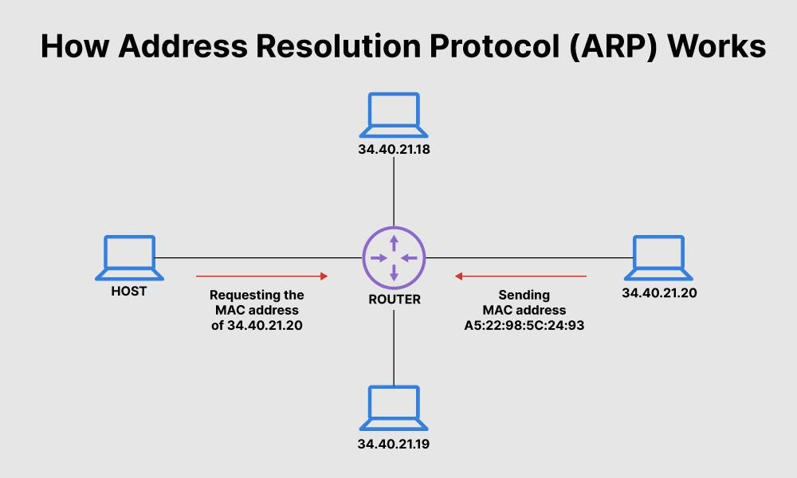

# Introduction to ARP (Address Resolution Protocol):

## Definition:
ARP (Address Resolution Protocol) is a network protocol used to map IP (Internet Protocol) addresses to MAC (Media Access Control) addresses on local networks.

## Purpose:
ARP enables devices on a local network to discover the corresponding MAC address for an IP address so that data packets can be sent between devices on the same network.

## How ARP Works:
ARP Request: When a device needs to send data to another device on the same local network, it checks its local ARP table to find the corresponding MAC address for the destination IP address. If not found, it sends an ARP request.

ARP Reply: The target device responds to the ARP request with its MAC address. The source device stores this information in its ARP table for future reference.

## ARP Table (ARP Cache):
ARP Table: Each device on a local network maintains an ARP table that associates IP addresses with MAC addresses. This table is used to expedite ARP resolution and stores information temporarily.

Table Aging: Entries in the ARP table may expire after a certain period of time to reflect changes in the network, preventing outdated information.

## Gratuitous ARP and ARP Poisoning:
Gratuitous ARP: It's an ARP message in which a device announces its own IP and MAC address on the network. It can be used to update ARP tables on other devices.

ARP Poisoning (ARP Spoofing): It's an attack in which a malicious device sends false ARP messages to deceive other devices and redirect traffic.

## ARP and Subnetted Networks:
ARP in Subnets: In networks with multiple subnets, devices only need to use ARP for devices within the same subnet. For devices in different subnets, the router intervenes.

## ARP in IPv4 and IPv6:
ARP in IPv4: It's widely used in IPv4 for MAC address resolution. However, IPv6 uses the ICMPv6 Neighbor Discovery Protocol instead of ARP.

## ARP and Network Security:
Security: ARP does not provide authentication, making it vulnerable to ARP poisoning attacks. Security measures like ARP inspection can be implemented to mitigate these risks.

## Examples of Use Cases:
Local Network Communication: ARP is crucial for efficient communication between devices on a local network, such as computers, printers, and routers.

Network Diagnostics: Network diagnostic tools, like the ARP command in the command prompt, can be used to check the ARP table and troubleshoot connectivity issues.

## Conclusion:
ARP plays an essential role in efficient communication on local networks. Understanding how it works and how it can be affected by security attacks is important for network administrators and IT professionals. ARP is a fundamental part of network infrastructure that enables devices to communicate on local networks effectively.
