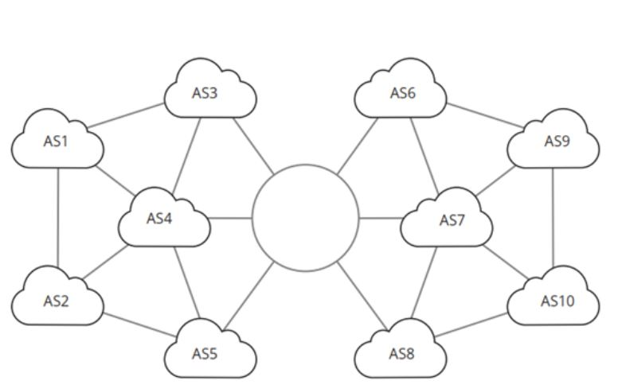

# Introduction to BGP

**Definition:** BGP (Border Gateway Protocol) is an inter-domain routing protocol used to exchange routing information between autonomous systems (ASes) on the Internet.

**Purpose:** BGP is designed to make complex routing decisions, such as choosing preferred routes, avoiding loops, and efficiently routing traffic on a global scale.

## How BGP Works

**Autonomous Systems (ASes):** ASes are entities that have autonomous control over their routing infrastructure. BGP is used to connect and exchange information between different ASes.

**BGP Peering:** Two BGP routers connect through a peering session to exchange routing information. There are two main types of BGP peering: customer peering and peer peering.

**BGP Attributes:** BGP uses attributes to make routing decisions, including AS_PATH (AS path), NEXT_HOP (next hop), LOCAL_PREF (local preference), and others.

## Routing Policies in BGP

**Routing Policies:** Network administrators can define routing policies in BGP to influence how traffic is routed. This includes route preferences, route filtering, and traffic control.

**AS-PATH Prepending:** A common technique to influence traffic is to repeatedly add one's own AS to the AS_PATH of advertised routes, making them less preferable to other ASes.

## BGP Update Flows

**BGP Updates:** BGP updates are messages that BGP routers exchange to inform each other about network routes.

**Route Announcements:** A BGP router can announce its routes to its BGP neighbors. This includes routes learned from other ASes and internal routes within the AS.

## BGP in ISP Networks

**Internet Service Providers (ISPs):** ISPs use BGP to interconnect different parts of the Internet and provide global connectivity.

**Multi-Homing:** ISPs and large enterprises use BGP to connect to multiple ASes for redundancy and traffic optimization.

## BGP Security

**Security Risks:** BGP is susceptible to attacks such as prefix hijacking and malicious route announcements. To mitigate these risks, techniques like RPKI (Resource Public Key Infrastructure) are used to verify the origin of routes.

## BGP Protocol vs. IGP

**Differences:** BGP is an inter-domain routing protocol, while IGPs (Interior Gateway Protocols) are used for internal routing within a single AS.

## Examples of Use Cases

**Global Connectivity:** BGP is crucial for maintaining global Internet connectivity, allowing data traffic to traverse the network efficiently.

**Service Providers:** ISPs and major service providers rely on BGP to route traffic between different parts of the Internet.

## Conclusion

BGP is a fundamental routing protocol for the global Internet. It plays a critical role in exchanging routing information between autonomous systems and ensuring that traffic is routed efficiently and in accordance with policies defined by network administrators. Understanding BGP is essential for network professionals working in global connectivity environments.
