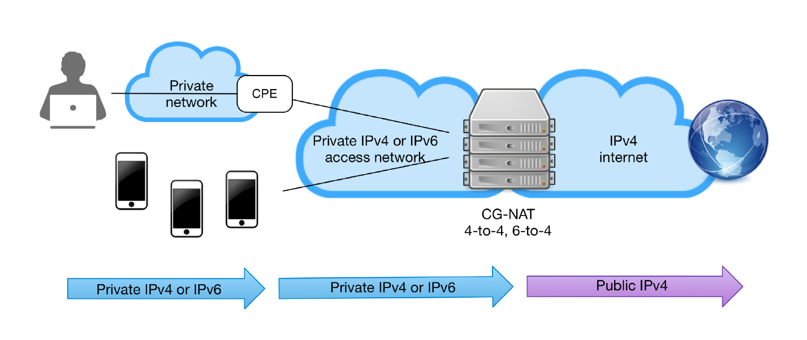

# What is CGNAT (Carrier-Grade Network Address Translation):

CGNAT is a technology used by Internet Service Providers (ISPs) and telecommunications carriers to address the scarcity of public IPv4 addresses. As IPv4 addresses are limited and depleted in many regions around the world, CGNAT allows multiple residences or businesses to share the same public IPv4 address to access the Internet.

## How CGNAT Works:

CGNAT works in a manner similar to traditional Network Address Translation (NAT) but on a much larger scale and in a telecommunications carrier environment. Here are the key components and how they operate:

**Private Addresses:** In homes and businesses, devices are typically connected to a private network using private IPv4 addresses like 192.168.x.x or 10.x.x.x. These addresses are not routable on the public Internet.

**Address Translation:** CGNAT sits between the customer's private network and the public Internet. When a device in the private network sends a packet to an Internet server, CGNAT translates the source IP address of the packet to a shared public IPv4 address owned by the carrier.

**Port Address Translation (PAT):** In addition to IP address translation, CGNAT also performs port translation. This means it assigns a specific port to each TCP or UDP connection, allowing multiple devices to share the same public IPv4 address.

**State Tracking:** CGNAT maintains a state table to track incoming and outgoing connections. This is necessary to ensure that responses from Internet servers are correctly directed back to devices in the private network.

**Dynamic Mapping:** CGNAT dynamically allocates public IPv4 addresses and ports to connections as needed. When the connection is terminated, these resources are released and can be reused for other connections.

## Advantages of CGNAT:

1. **IPv4 Address Conservation:** CGNAT enables ISPs to serve a large number of customers using a limited number of public IPv4 addresses.

2. **Improved IPv4 Address Utilization:** By sharing public addresses among multiple connections, CGNAT helps optimize the use of IPv4 addressing resources.

3. **Transition to IPv6:** CGNAT can serve as a short-term solution to IPv4 address shortage while carriers gradually migrate to IPv6, which offers a much larger address space.

## Disadvantages of CGNAT:

1. **Performance Issues:** CGNAT can introduce performance issues, such as response delays, due to the additional processing required for address and port translation.

2. **Peer-to-Peer Application Restrictions:** Some peer-to-peer applications may struggle to function correctly under CGNAT due to the complexity of connections.

3. **Tracking Challenges:** CGNAT makes it harder for ISPs to track specific activities of individual users, which can complicate security and policy enforcement matters.

In summary, CGNAT is an important technology for ISPs to cope with the scarcity of public IPv4 addresses and deliver Internet services to a large number of customers. However, it also presents challenges in terms of performance and connection management and is a temporary solution as the transition to IPv6 continues.
