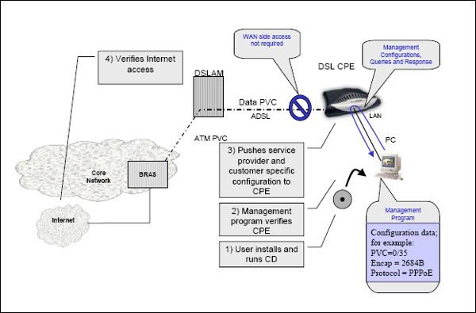

# Introduction to DSL (Digital Subscriber Line)

**Definition:** DSL (Digital Subscriber Line) is a broadband Internet access technology that utilizes existing copper telephone lines to transmit high-speed data.

**Purpose:** DSL enables both home and business users to have fast Internet access without the need for installing new fiber-optic cables.

## Types of DSL

**ADSL (Asymmetric DSL):** The most common form of DSL where download speed is greater than upload speed. Suitable for consumer applications such as web browsing and video streaming.

**SDSL (Symmetric DSL):** Offers equal upload and download speeds, making it suitable for applications requiring high bandwidth in both directions, like video conferencing.

**VDSL (Very-high-bit-rate DSL):** Provides higher speeds than ADSL or SDSL but has limited range. Commonly used in densely populated urban areas.

**DSL via Satellite:** In some rural regions, DSL via satellite is used to provide Internet access.

## How DSL Works

**Frequency Multiplexing:** DSL leverages unused frequencies on the telephone line to transmit digital data.

**DSL Modems:** DSL modems are used at the user's end to modulate and demodulate DSL signals, enabling digital communication.

## DSL Speeds

**Data Rates:** DSL speeds range from a few hundred kilobits per second (Kbps) to several megabits per second (Mbps) depending on the type of DSL and the distance to the telephone exchange.

## Benefits of DSL

**Utilizes Existing Infrastructure:** DSL uses already installed telephone lines, saving infrastructure costs.

**Availability in Urban and Rural Areas:** DSL is available in many areas, including rural regions where other broadband options may not be accessible.

## Limitations of DSL

**Distance Dependency:** DSL speed is affected by the distance between the user and the telephone exchange. Longer lines result in slower speeds.

**Limited Symmetry:** Most forms of DSL do not provide full symmetry in upload and download rates.

**Competition with Telephone Lines:** Simultaneous use of the telephone line for voice and DSL can impact call quality.

## DSL vs. Other Internet Access Technologies

**DSL vs. Cable:** DSL and cable Internet are both broadband technologies, but the choice depends on availability in the area and user requirements.

**DSL vs. Fiber Optic:** Fiber optic offers higher speeds and greater bandwidth than DSL, but availability may be limited in some areas.

## Examples of Use Cases

**Residential Use:** DSL is a popular choice for home Internet access due to its availability and reasonable cost.

**Business Use:** Businesses can use DSL for reliable and cost-effective Internet connections, especially in areas where fiber optic is unavailable.

## Conclusion

DSL is a widely adopted Internet access technology that enables high-speed connectivity through existing telephone lines. While it has limitations, such as dependency on the distance to the telephone exchange, DSL remains a valuable option for many users in urban and rural areas. It's important to understand its features and limitations when selecting an Internet access technology.
