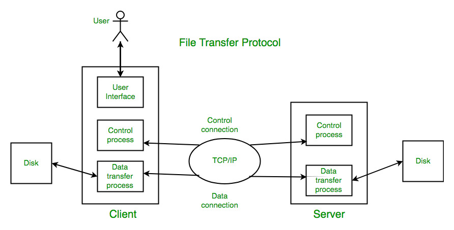

# Introduction to FTP:

## Definition:
FTP, or File Transfer Protocol, is a standard Internet protocol that allows the transfer of files between computer systems on a network.

## Purpose:
FTP is used to share and transfer files such as text, images, documents, and other file types between computers, servers, and devices.

## How FTP Works
Operating Mode: FTP operates on a client-server model, where an FTP client establishes a connection with an FTP server to transfer files.

Default Port: The default port for FTP is port 21 for control communication and port 20 for data communication.

## FTP Transfer Modes
Active Transfer Mode: In active mode, the server opens a port for data transfer, and the client connects to that port.

Passive Transfer Mode: In passive mode, the client requests the server to provide a port for data transfer and connects to that port.

## Basic FTP Commands
Control Commands: Commands like USER (for authentication), PASS (for password), QUIT (to exit the session), and HELP (for getting help information).

Transfer Commands: Commands like GET (to download files from the server), PUT (to upload files to the server), and LIST (to list files on the server).

## Types of FTP
Anonymous FTP: Allows users to connect to FTP servers without authentication, typically with limited access for public downloads.

Authenticated FTP: Requires authentication with a username and password to access the FTP server, providing increased security.

## FTP Security
Security Issues: Standard FTP does not encrypt data during transfer, making it insecure for environments where data privacy is critical.

Security Solutions: FTPS (FTP Secure) and SFTP (SSH File Transfer Protocol) are secure solutions for encrypting FTP communications.

## Practical Use of FTP
FTP Clients: Many FTP clients are available for various operating systems, such as FileZilla, WinSCP, and built-in FTP commands in Unix-based systems.

Setting Up FTP Servers: Administrators can configure FTP servers to make files available for sharing with other users.

## Examples of Use Cases
Web Hosting: Developers use FTP to transfer files from a local computer to a web server to publish a website.

Remote Backup: FTP is used to transfer backups from local systems to remote backup servers.

## Conclusion
FTP is a fundamental technology for file transfer on the network but requires security considerations when used in sensitive environments. Understanding how FTP works and what security measures are available is important to ensure secure and efficient file transfers.
