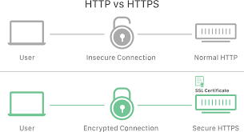

# Introduction to HTTP and HTTPS:

## Definition:
HTTP (Hypertext Transfer Protocol) is an application protocol used for transferring data on the web, while HTTPS is a secure version of HTTP that uses encryption to protect communications.

## Purpose:
Both protocols are used to request and deliver web pages, resources, and data over the Internet.

## How HTTP Works
Client-Server Model: HTTP operates on a client-server model, where a client (usually a web browser) makes requests to a server (a computer hosting web content).

HTTP Methods: HTTP uses methods like GET (to retrieve information), POST (to send data), and others to specify the action the client wants to perform on the server.

## HTTP vs. HTTPS
HTTP: HTTP communications are transmitted in plain text, making data vulnerable to interception by third parties.

HTTPS: HTTPS uses SSL/TLS encryption to protect communications, making data unreadable to anyone without the decryption key.

## Security and SSL/TLS Certificates
SSL/TLS Certificates: A website using HTTPS has an SSL/TLS certificate issued by a Certificate Authority (CA) and used to establish a secure connection.

Encryption: HTTPS secures sensitive information such as passwords and credit card numbers during transmission.

## Lifecycle of an HTTP/HTTPS Request
Request: The client sends an HTTP/HTTPS request to the server, specifying a method (GET, POST, etc.) and a resource (URL).

Server Processing: The server processes the request and returns a response, typically including a status code (e.g., 200 for success) and the requested data.

## HTTP Headers
Request Headers: Include information about the client's browser, acceptable content types, and more.

Response Headers: Include information about the server, such as server type, modification date, and more.

## Cookies and Sessions
Cookies: Are small pieces of data stored in the client's browser, allowing tracking of information like preferences and authentication.

Sessions: Are used to maintain client-state information, including authentication, on the server between requests.

## HTTP/2 and HTTP/3
HTTP/2: A newer version of HTTP that improves web communication performance and efficiency.

HTTP/3: Even more recent, it uses the QUIC protocol to further enhance performance by reducing latency.

## Examples of Use Cases
Web Browsing: Browsers use HTTP/HTTPS to request and display web pages, images, and other resources.

Financial Transactions: HTTPS is crucial for protecting payment information during online purchases.

Secure Email: Many email services use HTTPS to secure authentication and communication between the email client and server.

## Conclusion
HTTP and HTTPS are fundamental protocols for web communication. Understanding their differences, how they work, and their importance for online security is crucial for web developers, system administrators, and internet users. HTTPS, in particular, plays a crucial role in protecting sensitive information in online environments.
