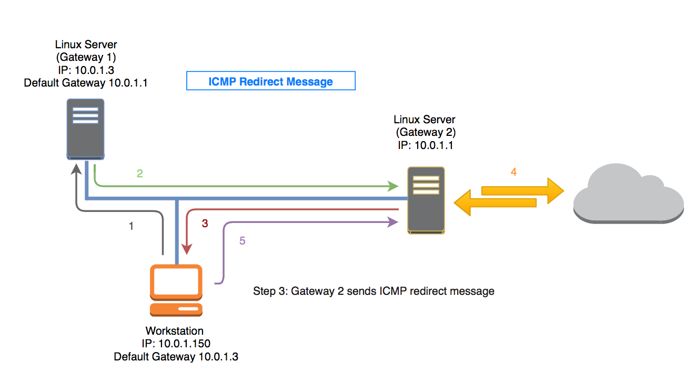

# Introduction to ICMP (Internet Control Message Protocol):

## Definition:
ICMP, or Internet Control Message Protocol, is a message protocol used for communication between devices in an IP (Internet Protocol) network.

## Purpose:
ICMP is primarily used for reporting errors, status, and control information in IP communication.

## Standard ICMP Messages:
1. **Echo Request and Echo Reply:** Used by the "ping" command to check network connectivity. An Echo Request is sent to a remote device, which should respond with an Echo Reply.

2. **Destination Unreachable:** Indicates that a destination is unreachable, providing details about the reason.

3. **Time Exceeded:** Indicates that a packet has exceeded the allowed time to reach its destination, usually due to a routing loop.

4. **Redirect:** Used to inform a device that there is a more efficient routing path to a specific destination.

## Traceroute and ICMP:
- **Traceroute:** A tool that uses ICMP Time Exceeded messages to trace the route that packets take to reach a destination, showing intermediate hops in the network.

## ICMP and Security:
- **Ping Flooding:** An attack where a large number of Echo Request packets are sent to a target to overwhelm the network.

- **ICMP Redirect Attack:** An attack where an attacker sends fake ICMP Redirect messages to alter traffic routing in a network.

## ICMP Error Messages:
- **Port Unreachable:** Used to indicate that a specific port on a destination is not accessible.

- **Fragmentation Needed:** Indicates that a packet is too large to be transmitted on the network without additional fragmentation.

## ICMPv6:
- **ICMP for IPv6:** The version of ICMP used with IPv6, which includes similar messages to ICMPv4 but also some specific messages for IPv6.

## Responsible Use of ICMP:
- **Blocking or Filtering:** It's important to understand the risks and benefits of blocking or filtering ICMP messages on a network.

## Examples of Use Cases:
- **Network Troubleshooting:** ICMP is widely used to identify connectivity issues and diagnose problems in networks.

- **Network Monitoring:** Network monitoring tools like "ping" and "traceroute" use ICMP to provide information about network status.

## Conclusion:
ICMP is a vital protocol for communication and diagnosing issues in IP networks. Its set of messages provides crucial information for network administrators and helps maintain and troubleshoot connectivity problems in networks. Responsible use of ICMP is essential for ensuring efficient and secure network operation.
