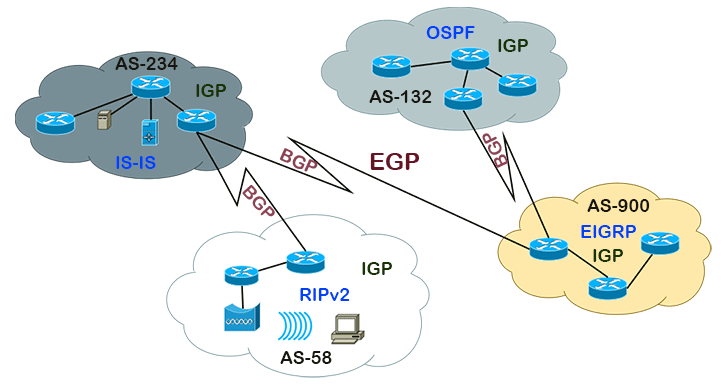

# Introduction to IGP and EGP

**IGP (Interior Gateway Protocol):** It is a type of routing protocol used to exchange routing information within an internal network, such as a LAN or an intranet.

**EGP (Exterior Gateway Protocol):** It is a type of routing protocol used to exchange routing information between different autonomous systems (ASes) on the Internet.

## Interior Gateway Protocol (IGP)

**Purpose:** IGPs are designed for routing within a network or autonomous system.

**Examples of IGPs:** Some examples of IGPs include RIP (Routing Information Protocol), OSPF (Open Shortest Path First), and EIGRP (Enhanced Interior Gateway Routing Protocol).

## Exterior Gateway Protocol (EGP)

**Purpose:** EGPs are designed for routing between different autonomous systems (ASes) on the Internet.

**Examples of EGPs:** BGP (Border Gateway Protocol) is the most widely used EGP on the Internet for exchanging routing information between autonomous systems.

## Characteristics of IGPs

**Limited Topology:** IGPs typically operate in networks with a limited topology, such as a local network (LAN) or an intranet.

**Simple Metrics:** Most IGPs use simple metrics, such as hop count or bandwidth, to determine the shortest routes.

## Characteristics of EGPs

**Scalability:** EGPs are designed for large-scale networks, such as the Internet, where multiple networks and autonomous systems need to exchange routing information.

**Routing Policies:** EGPs allow the implementation of complex routing policies, such as route preferences, traffic control, and security.

## Common IGP Protocols

**RIP (Routing Information Protocol):** A distance-vector IGP used in small to medium-sized networks.

**OSPF (Open Shortest Path First):** A link-state IGP widely used in medium to large-sized networks.

**EIGRP (Enhanced Interior Gateway Routing Protocol):** An IGP developed by Cisco with advanced features.

## Common EGP Protocols

**BGP (Border Gateway Protocol):** The most widely used EGP on the Internet for routing between autonomous systems.

## Differences Between IGP and EGP

**Scope:** IGP is used for internal networks, while EGP is used for routing between autonomous systems on the Internet.

**Complexity:** EGP is generally more complex due to the need to handle routing policies and the scale of the Internet.

## Examples of Use Cases

**IGP:** Used in corporate networks, university campuses, and intranets for internal routing.

**EGP:** Used on the Internet for routing between different networks and autonomous systems.

## Conclusion

IGPs and EGPs play distinct roles in the world of data routing. IGPs are suitable for internal routing in smaller networks, while EGPs are essential for exchanging routing information on a large scale on the Internet. Understanding the difference between these types of protocols is crucial for designing and managing effective and scalable networks.
