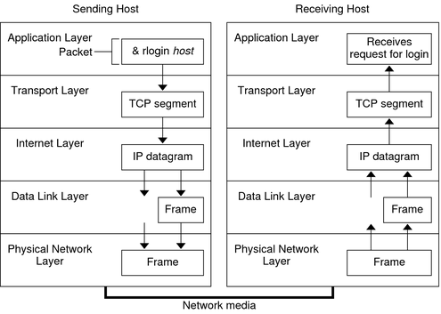

# What is IP (Internet Protocol) and TCP (Transmission Control Protocol):

## Internet Protocol (IP):

**Definition:** The Internet Protocol (IP) is a communication protocol that facilitates the delivery of data in computer networks, including the Internet. It provides the foundation for transmitting data packets from one device to another within a network.

**IP Addressing:** Every device in an IP network is assigned a unique IP address, which is a numerical sequence that identifies the device on the network. There are two main versions of IP in use today: IPv4 and IPv6, with IPv4 being the most common.

**Routing:** IP is responsible for routing data packets from source to destination across interconnected networks. Routers are devices that play a crucial role in this process, forwarding packets from one network to another until they reach the final destination.

**Unreliable Service:** IP provides an unreliable service, meaning it does not guarantee packet delivery or order. It simply attempts to efficiently forward packets without concern for data integrity.

## Transmission Control Protocol (TCP):

**Definition:** The Transmission Control Protocol (TCP) is a transport layer protocol that operates above IP. It provides a reliable point-to-point data communication service, ensuring that data is delivered in order and without errors.

**Reliability:** TCP is designed to ensure that data is delivered safely and with integrity. It uses techniques such as acknowledgment, retransmission of lost packets, and congestion control to ensure transmission reliability.

**Flow Control:** TCP also implements flow control, meaning it adjusts the transmission rate based on network capacity and the receiver's ability to process data. This prevents network congestion.

**TCP Ports:** TCP uses ports to identify specific services on devices. This allows multiple different services to run on the same device and communicate accurately through designated ports.

## How IP and TCP Work Together:

When you send data over the Internet, IP and TCP work together as follows:

1. Your device breaks data into small packets.
2. Each packet is marked with a destination IP address and a destination TCP port number.
3. The packets are transmitted across the network using IP for routing.
4. At the destination, TCP receives the packets, reorders them correctly, and verifies that all packets were received.
5. If any packet is missing or damaged, TCP requests its retransmission.
6. Once all packets are successfully received and in order, TCP delivers the data to the appropriate application.

This combination of IP and TCP is essential for reliable communication on the Internet and forms the basis for most services and applications we use daily, such as web browsing, email, file transfer, and video conferencing. They provide the necessary infrastructure for efficient data communication in computer networks worldwide.
