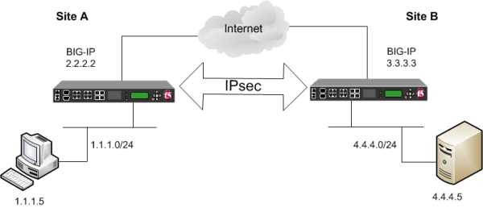

# Introduction to IPSec (Internet Protocol Security):

## Definition:
IPSec, or Internet Protocol Security, is a set of protocols and technologies designed to ensure the confidentiality, integrity, and authenticity of network communications.

## Purpose:
IPSec is used to protect network traffic against threats such as eavesdropping, unauthorized modification, and interception.

## Components of IPSec:
1. **Protocols:** IPSec consists of various protocols, including the Authentication Header (AH), the Encapsulating Security Payload (ESP), and key management protocols.

2. **Operating Modes:** IPSec can operate in two main modes: Transport Mode and Tunnel Mode.

3. **Security Policies:** Security policies define how traffic is protected, including which connections should be secured and which cryptographic algorithms should be used.

## Authentication and Integrity:
- **Authentication Header (AH):** AH is used to ensure the authenticity and integrity of data packets. It adds an authentication header containing a message authentication code (MAC).

## Confidentiality:
- **Encapsulating Security Payload (ESP):** ESP is used to provide confidentiality by ensuring that transmitted data cannot be read by unauthorized third parties. It uses encryption to protect the content of packets.

## Key Management:
- **Key Negotiation Protocols:** IPSec uses protocols like Internet Key Exchange (IKE) to establish shared encryption keys between devices.

- **Symmetric and Asymmetric Keys:** Symmetric keys (or session keys) are used to encrypt and decrypt traffic. Asymmetric keys (or public keys) are used for device authentication and securely exchanging symmetric keys.

## IPSec Implementations:
- **Virtual Private Network (VPN):** IPSec is commonly used to create secure VPNs that allow users and remote networks to securely connect to the corporate network over the Internet.

- **Remote Access:** It is used to secure remote access connections, such as employee VPN connections when working from home.

## Challenges and Implementation Considerations:
- **Compatibility:** Ensuring that devices and systems are IPSec-compatible can be a challenge, especially in heterogeneous environments.

- **Key Management:** Key management can be complex, requiring clear policies and effective key exchange and renewal systems.

## Examples of Use Cases:
- **Site-to-Site VPN:** Protecting communication between two geographically distant corporate networks.

- **Remote Employee Access:** Allowing employees to securely access the corporate network while working remotely.

## Conclusion:
IPSec plays a crucial role in safeguarding network communications on the Internet by ensuring the confidentiality, integrity, and authenticity of transmitted data. It is widely used in corporate environments and for configuring secure VPNs. Understanding its components, operating modes, and implementation challenges is essential to ensuring the security of computer network communications.
