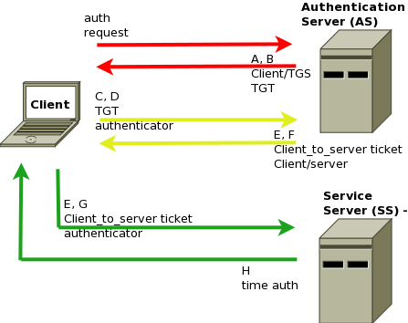

# Introduction to Kerberos

**Definition:** Kerberos is a strong authentication protocol that provides network security through the authentication of users, machines, and services.

**Origin of the Name:** The name "Kerberos" is derived from the three-headed dog that guards the entrance to the underworld in Greek mythology.

## Objectives of Kerberos

**Authentication:** Kerberos's main objective is to ensure that users and services involved in communication are securely authenticated.

**Confidentiality and Integrity:** In addition to authentication, Kerberos can also provide confidentiality and integrity of messages exchanged between parties.

## How Kerberos Works

**Third-Party of Trust:** Kerberos uses a third-party of trust called the KDC (Key Distribution Center), which acts as an intermediary between the user and the service to be accessed.

**Step-by-Step Authentication:** The authentication process in Kerberos is divided into steps, with message exchanges between the user, KDC, and the service.

## Components of Kerberos

**KDC (Key Distribution Center):** The KDC is a server that manages authentication and key distribution in the Kerberos system. It consists of two parts: AS (Authentication Server) and TGS (Ticket Granting Server).

**Tickets:** Kerberos uses tickets to authenticate users. Tickets are issued by AS and used by TGS to grant access to services.

## Authentication Process

1. The user requests a ticket from AS to access a specific service.
2. AS verifies the user's authenticity and, if valid, issues a TGT (Ticket Granting Ticket).
3. The user requests a ticket for the desired service from TGS using the TGT.
4. TGS verifies the TGT and issues a service ticket, which is used to access the service.
5. The service verifies the service ticket and, if valid, grants access to the user.

## Security in Kerberos

**Cryptographic Keys:** Kerberos uses cryptographic keys to protect communications between the user, KDC, and the service. This ensures confidentiality and integrity.

**Two-Factor Authentication:** Kerberos employs two-factor authentication, as the user needs something they know (password) and something they have (TGT) to access a service.

## Use of Kerberos in Corporate Environments

**Windows Domains:** Kerberos is widely used in Windows environments to authenticate users and machines within a domain.

**Single Sign-On (SSO):** Kerberos forms the basis for SSO systems, allowing users to access multiple applications with a single authentication.

## Limitations of Kerberos

**Time Dependency:** Kerberos relies on precise clock synchronization among the involved parties, which can be challenging in globally distributed networks.

**Not Suitable for Open Internet:** While suitable for controlled corporate environments, Kerberos is not the ideal choice for authentication on the open internet due to scalability challenges.

## Conclusion

The Kerberos protocol is a powerful tool for secure authentication in corporate networks and controlled environments. It offers robust protection against security threats, ensuring the authenticity of parties involved in communications. Understanding how Kerberos works is essential for system administrators and information security professionals looking to maintain the integrity and confidentiality of networks and systems in their environments.
