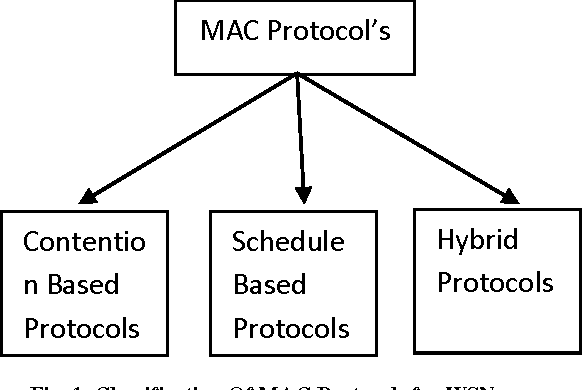

# What is a MAC Address?

A MAC Address is a unique identifier assigned to every network device, such as computers, smartphones, printers, and routers, to distinguish these devices on an Ethernet network. It is embedded in the hardware of each device during manufacturing and cannot be permanently changed. The MAC Address is an essential part of the medium access control protocol in local area networks (LANs).

## MAC Address Format:

The MAC Address is a 48-bit hexadecimal number (or 6 bytes), typically represented in the XX:XX:XX:XX:XX:XX format, where each "XX" represents a two-digit hexadecimal value. For example: 00:1A:2B:3C:4D:5E.

## MAC Address Structure:

- **OUI (Organizational Unique Identifier):** The first 24 bits (3 bytes) of the MAC Address represent the Organizational Unique Identifier (OUI), which is assigned to network device manufacturers. Each manufacturer has its own OUI, which is a unique number.

- **Device Identifier (or NIC Specific):** The last 24 bits (3 bytes) of the MAC Address represent a unique identifier assigned by the manufacturer to the specific device. This ensures that each device has a unique MAC Address, even if the manufacturer produces multiple devices with the same OUI.

## MAC Address Function:

The MAC Address serves primarily two main functions:

1. **Unique Identification:** It provides a unique identification for each device on a network. This is crucial to ensure that data is routed to the correct device on a local network, especially when multiple devices are connected.

2. **Medium Access Control (MAC Address Filtering):** The MAC Address is used in many routers and switches to implement security measures, such as MAC address filtering. This allows the network administrator to control which devices can or cannot connect to the network based on their MAC Addresses.

## How to Find Your Device's MAC Address:

The method to find your device's MAC Address varies depending on the operating system and device type. Here are some general examples:

- **Windows:** You can open the command prompt and type "ipconfig /all" to view network interface information, including the MAC Address (referred to as the "Physical Address").

- **macOS:** In network preferences, you can click "Advanced" and go to the "Hardware" tab to find the MAC Address.

- **Linux:** You can use the "ifconfig" or "ip a" command in the terminal to display network information, including the MAC Address.

- **Smartphones and Tablets:** Network or Wi-Fi settings often display the MAC Address of the wireless interface.

Please note that while the MAC Address is unique and essential for communication in local networks, it can be spoofed (falsified) by malicious users, so it should not be the sole security measure in a network. Additionally, wireless networks (Wi-Fi) have different MAC Addresses for each interface (Wi-Fi and Ethernet), and these may vary.
