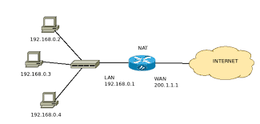

# Introduction to NAT

**Definition:** NAT (Network Address Translation) is a technique used in computer networks to translate IP addresses from one addressing scheme to another.

**Purpose:** NAT is widely employed to allow multiple machines on a local network to share a single Internet connection using a single public IP address.

## Types of NAT

**Static NAT:** Permanently associates a public IP address with a private IP address. It is commonly used when internal services, such as web servers, need to be made available on the Internet.

**Dynamic NAT:** Temporarily allocates public IP addresses to internal devices as they request Internet access. It is the most common form of NAT for sharing a single Internet connection.

**Port Address Translation (PAT):** Also known as Multi-port NAT, it allows multiple internal devices to share a single public IP address, translating not only IP addresses but also TCP/UDP ports.

## How NAT Works

**Address Translation:** NAT translates IP addresses and, when applicable, TCP/UDP ports of internal devices to a public IP address as needed.

**Translation Table (NAT Table):** NAT maintains a translation table that maps internal IP addresses to associated public IP addresses.

**Port Forwarding:** In static NAT, port forwarding allows specific services on internal devices to be accessible from the Internet.

## Common Use of NAT

**Internet Sharing:** NAT is often used in home and small business networks to enable multiple devices to share a single Internet connection.

**Security:** NAT acts as a basic firewall, hiding internal IP addresses from the Internet and preventing unsolicited traffic from reaching the internal network.

## Advantages and Disadvantages of NAT

**Advantages:** Enhances security, enables Internet sharing, conserves public IP addresses, simplifies network configuration.

**Disadvantages:** Can make hosting services on the Internet challenging, introduces complexity in larger networks, may impact performance in some cases.

## IPv4 and IP Address Exhaustion

**Motivation:** The depletion of public IPv4 addresses drove the widespread adoption of NAT as a temporary solution.

**IPv6:** IPv6, with its vast address space, was designed to overcome address scarcity and eliminate the need for NAT in much of the network.

## NAT in Enterprise Networks

**Enterprise Use:** Businesses can use NAT to conceal internal networks and allow controlled Internet access.

**NAT Pools:** Companies with multiple Internet connections can use Port Address Translation (PAT) to map multiple Internet connections to internal devices.

## Security and Limitations of NAT

**Security:** NAT provides an additional layer of security by hiding internal IP addresses but is not a complete substitute for a dedicated firewall.

**Limitations:** Some peer-to-peer applications and certain types of real-time communication may have issues with NAT, requiring special configurations.

## Conclusion

NAT is a fundamental technique in computer networks, playing a significant role in enabling the sharing of a single Internet connection among multiple devices and providing an additional layer of security. With the ongoing transition to IPv6, the need for NAT may decrease, but it remains a vital part of existing IPv4 networks. Understanding how NAT works is essential for network administrators and IT professionals.
