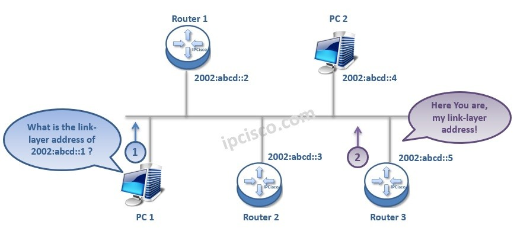

# Introduction to NDP (Neighbor Discovery Protocol):

## Definition:
NDP (Neighbor Discovery Protocol) is a set of protocols used in IPv6 networks to perform essential functions such as discovering neighboring devices, resolving addresses, and configuring network parameters.

## Purpose:
NDP is fundamental for the efficient operation of IPv6 networks, replacing several functions performed by ARP (Address Resolution Protocol) in IPv4.

## Functions of NDP:
Address Resolution (IPv6 ARP): NDP allows a device to discover the MAC address associated with an IPv6 address, much like ARP does for IPv4.

Router Discovery: NDP helps devices find routers on the network, identify default routers, and learn other important network configuration information.

IPv6 Address Autoconfiguration: NDP facilitates the automatic assignment of IPv6 addresses to devices on the network, eliminating the need for manual configuration.

## Elements of NDP:
NDP Requests and Responses: Devices send NDP messages such as Neighbor Solicitation requests and Neighbor Advertisement responses to perform tasks like address resolution.

Router Advertisement: Routers periodically send Router Advertisement messages to announce their presence and availability on the network.

Router Solicitation: Devices joining the network send Router Solicitation requests to locate available routers.

## Address Resolution with NDP:
Resolution Process: When a device needs the MAC address corresponding to an IPv6 address, it sends a Neighbor Solicitation request to the network.

Resolution Cache: Devices maintain an NDP resolution cache (also known as an IPv6 ARP table) to store information about recently resolved addresses.

## Router Discovery with NDP:
Router Advertisement: Routers periodically send Router Advertisement messages to inform network devices about their presence and provide information such as the network prefix.

Router Solicitation: Devices initiate Router Solicitation requests to locate routers on the network.

## IPv6 Address Autoconfiguration:
SLAAC (Stateless Address Autoconfiguration): NDP enables devices to automatically obtain IPv6 addresses using information provided by routers in the Router Advertisement message.

## NDP Security:
Mitigating Attacks: NDP can be vulnerable to cache poisoning attacks and route redirection attacks. Security measures such as RA Guard and DHCPv6 Guard help mitigate these risks.

## Examples of Use Cases:
IPv6 Networks: NDP is crucial for the operation of IPv6 networks, allowing devices to discover each other, locate routers, and automatically configure addresses.

Network Configuration: Network administrators use NDP messages to configure network parameters on remote devices.

## Conclusion:
NDP plays a critical role in efficient communication in IPv6 networks, enabling devices to discover each other, locate routers, and configure addresses automatically. Understanding how NDP works is essential for network administrators and IT professionals working with IPv6 networks.
