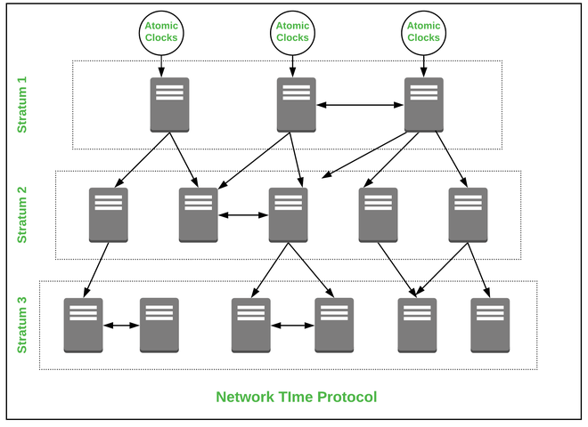

# Introduction to NTP

**Definition:** NTP (Network Time Protocol) is a network protocol that enables precise synchronization of clocks on computing devices within a network.

**Importance:** Time synchronization is crucial to ensure that events in network systems and computers are accurately recorded, facilitating troubleshooting and auditing.

## How NTP Works
**Server Hierarchy:** NTP operates in a hierarchy of servers, with highly accurate clocks at the top layer and less accurate clocks in lower layers.

**Requests and Responses:** Client devices send requests to NTP servers, which respond with time information. Client devices adjust their clocks based on these responses.

## NTP Server Strata
**Stratum 0:** These are primary reference devices, such as atomic clocks and GPS receivers.

**Stratum 1:** These are NTP servers that synchronize directly with Stratum 0 devices.

**Stratum 2:** These are NTP servers that synchronize with Stratum 1 servers, and so on.

## Precision in NTP
**Offset and Precision:** NTP measures the offset between a device's local clock and the time obtained from an NTP server. Precision is a measure of how close the offset is to zero.

**Adjustment Algorithm:** NTP uses an algorithm to gradually adjust a device's clock to synchronize it with the reference time.

## Types of NTP Servers
**Public NTP Servers:** These are NTP servers available publicly on the Internet, but their accuracy may vary.

**Private NTP Servers:** These are NTP servers configured internally within corporate networks for greater accuracy and security.

## NTP Configuration and Usage
**NTP Client:** To configure an NTP client, you need to specify one or more NTP servers that the client will query for time.

**NTP Server:** To configure an NTP server, you define which devices are its time sources and how it will distribute time to other devices.

## Security in NTP
**Authentication:** NTP can use authentication to ensure that time responses from NTP servers are reliable and not tampered with.

**Restricted Access:** It's important to restrict access to NTP servers to prevent abuse.

## Alternatives to NTP
**SNTP (Simple Network Time Protocol):** A simplified version of NTP suitable for applications where strict accuracy is not required.

**PTP (Precision Time Protocol):** Used in industrial and telecommunications environments to provide highly accurate time synchronization.

## Common Uses of NTP
**Network Synchronization:** NTP is used to maintain time synchronization in computer networks, ensuring that all devices have an accurate view of time.

**Critical Applications:** In sectors like financial services, telecommunications, and healthcare, precise event timing is crucial, making NTP essential.

## Conclusion
NTP plays a critical role in maintaining time accuracy in network devices and computer systems. Precise time synchronization is essential for troubleshooting, auditing, security, and many other aspects of network and system operations. Understanding how NTP works and how to configure it is essential for network and system administrators.
