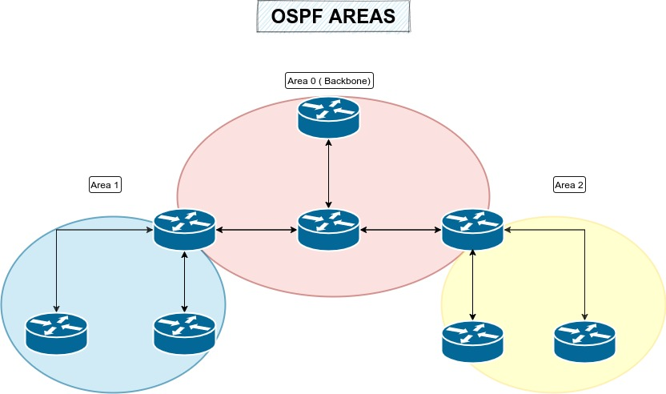

# Introduction to OSPF (Open Shortest Path First):

## Definition:
OSPF (Open Shortest Path First) is an interior gateway routing protocol used to determine the shortest routes (paths) in an IP network and efficiently forward packets.

## Purpose:
OSPF is widely adopted in large-scale networks, such as corporate and service provider networks, for dynamic and scalable routing.

## How OSPF Works:
Link-State Routing: OSPF uses a network topology table, which describes the network layout and the state of all links, to calculate the best routes.

OSPF Areas: OSPF networks are divided into areas, which allow scalability and resilience. Smaller areas mean less routing overhead.

Link-State Protocol: OSPF exchanges link-state information, including cost metrics, with other OSPF routers to calculate routes.

## Types of OSPF Routers:
Internal Router (IR): A router that belongs to a single OSPF area.

Area Border Router (ABR): A router that connects two or more OSPF areas and acts as a gateway between them.

Backbone Area Border Router (ASBR): A router that interconnects an OSPF area with external networks using another routing protocol.

## OSPF Route Calculation:
OSPF Metric: OSPF uses a cost metric based on link bandwidth. Lower cost indicates a better route.

Dijkstra SPF Algorithm: The SPF algorithm is used to calculate the best routes based on link costs.

## OSPF Backbone Area (Area 0):
Backbone Area: The backbone area (Area 0) is a special area in an OSPF network that connects all other OSPF areas.

Transit Area: The backbone area serves as a transit area through which traffic flows between different OSPF areas.

## OSPF Authentication and Security:
OSPF Authentication: OSPF supports authentication to protect routing updates exchanged between OSPF routers.

OSPF Security: Secure OSPF implementations include protection against false information injection attacks.

## Examples of Use Cases:
Corporate Networks: OSPF is commonly used in enterprise networks for internal routing, allowing the network to expand and adapt as needed.

Service Providers: Large Internet service providers use OSPF to manage routing in their networks, enabling efficient connectivity.

## OSPF Challenges and Solutions:
Scalability: Very large OSPF networks may face scalability challenges. This can be mitigated by using areas.

Convergence: OSPF may take some time to converge after topology changes. Complex networks may require optimizations.

## Conclusion:
OSPF is a powerful and scalable routing protocol that plays a fundamental role in large-scale networks. Understanding its basics, configuration, and management is essential for network administrators and IT professionals working with complex and dynamic networks. OSPF offers the ability to build efficient and resilient networks that adapt to changes in network topology.
