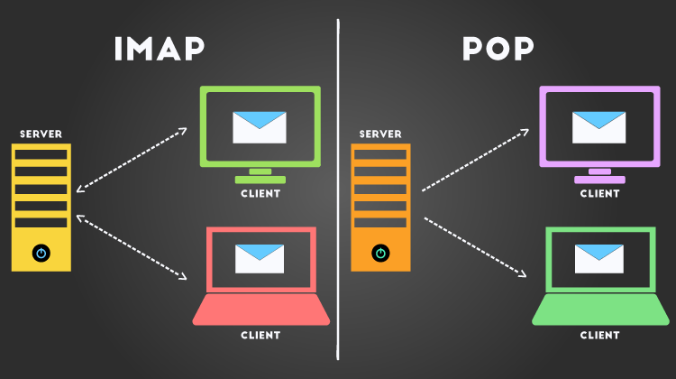

# Introduction to POP3 and IMAP

**Definition:** POP3 and IMAP are email access protocols that allow users to retrieve messages from their mailboxes on email servers.

**Purpose:** Both protocols aim to provide users with the ability to read, organize, and download email messages to their devices.

## POP3 (Post Office Protocol 3)

**Operation:** POP3 allows email clients to download messages from their mailboxes on the server to the local device. Messages are typically deleted from the server after download, though this can be configured differently.

**Offline Use:** POP3 is suitable for situations where the user wants to access emails offline, as messages are downloaded locally.

**Default Port:** The default TCP port for POP3 is 110.

## IMAP (Internet Message Access Protocol)

**Operation:** IMAP allows email clients to access their mailboxes on the server remotely. Messages remain on the server, and the client can synchronize with the server to reflect changes made.

**Multiple Access:** IMAP is suitable for situations where the user accesses the mailbox from multiple devices, as messages remain synchronized across all of them.

**Default Port:** The default TCP port for IMAP is 143. For secure IMAP (IMAPS), the port is 993.

## Differences Between POP3 and IMAP

**Storage:** POP3 downloads messages to the local device and, by default, removes them from the server. IMAP keeps messages on the server and allows the user to access them from multiple devices.

**Offline Access:** POP3 allows offline access after downloading messages. IMAP requires an internet connection to access messages since they remain on the server.

**Synchronization:** IMAP synchronizes user actions across all devices, whereas POP3 does not have this functionality.

## Common Use of POP3 and IMAP

**POP3:** It is suitable for users who prefer to keep local copies of messages and do not need to access them from multiple devices. It may be more appropriate for personal email accounts.

**IMAP:** It is suitable for users who want to access emails from multiple locations and devices and keep their messages synchronized. It is common in corporate email settings.

## Security in the Protocols

**Encryption:** It is highly recommended to use encryption when configuring POP3 and IMAP to protect the privacy of communications.

**POP3S and IMAPS:** The secure versions of these protocols (POP3S and IMAPS) use SSL/TLS encryption to secure transactions.

## Alternatives and Related Protocols

**SMTP:** Protocol used to send emails.

**MIME:** Protocol used to format email messages, including attachments.

## Email Client Configuration

**POP3 Configuration:** When configuring an email client to use POP3, you will need to provide information about the POP3 server, port, and credentials.

**IMAP Configuration:** To set up an email client to use IMAP, you will provide information about the IMAP server, port, and credentials.

## Conclusion

Both POP3 and IMAP are essential protocols for email management, each with its own advantages and use cases. The choice between them depends on the user's needs, such as offline access, synchronization between devices, and storage preferences. Understanding the differences between these protocols is crucial for setting up and correctly using email accounts.
