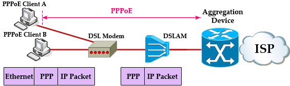

# Introduction to PPP and PPPoE

**Definition:** PPP (Point-to-Point Protocol) is a network protocol that enables communication between two devices over a point-to-point connection. PPPoE (Point-to-Point Protocol over Ethernet) is an extension of PPP commonly used to establish broadband connections over Ethernet networks.

**Purpose:** PPP is used to establish point-to-point connections in dial-up networks and can carry various types of traffic, including IPv4, IPv6, and network control protocols. PPPoE is used to connect broadband clients to Internet access networks, such as DSL and cable.

## How PPP Works
**Link Layer:** PPP operates at the link layer of the OSI model and is often used to connect two devices, such as a computer and a modem, over a telephone line or cable.

**Connection Establishment:** PPP initiates a negotiation between devices to establish a connection. This involves the exchange of control messages for authentication and parameter configuration.

## How PPPoE Works
**Emulating Local Area Network:** PPPoE emulates a local area network (LAN) connection over an Ethernet link. This allows multiple devices within a LAN to share a single broadband connection.

**Clients and Servers:** PPPoE involves a client (usually a router or computer) connecting to a PPPoE server (typically at the Internet service provider's headquarters) to gain Internet access.

## Configuration of PPP and PPPoE
**Authentication:** PPP and PPPoE often involve client authentication with the server. This can be done using passwords, usernames, and other authentication methods.

**IP Addressing:** After authentication, clients typically receive an IP address assigned by the Internet service provider (ISP) to access the Internet.

## Security in PPPoE
**Encryption:** PPPoE can be configured with encryption to protect communications between the client and the PPPoE server.

**Strong Passwords:** It's important for clients to choose strong passwords for PPPoE authentication to prevent unauthorized access.

## Common Uses of PPP and PPPoE
**PPPoE in Internet Access:** PPPoE is frequently used in broadband connections, such as DSL and cable, to provide Internet access to residences and businesses.

**PPP in Dial-Up Connections:** PPP is used in dial-up connections, such as analog phone lines, to establish an Internet connection.

## Advantages and Disadvantages
**Advantages of PPPoE:** PPPoE allows sharing a single broadband connection among multiple devices in a LAN. It offers flexibility in authentication and addressing configuration.

**Disadvantages of PPPoE:** Authentication and encapsulation add some processing overhead and headers to communication. There may be a slight reduction in effective bandwidth due to this overhead.

## Alternatives to PPPoE
**PPPoA (Point-to-Point Protocol over ATM):** An alternative to PPPoE used in DSL networks that employ ATM technology.

**IPoE (IP over Ethernet):** In some broadband networks, such as fiber-optic networks, PPPoE is not necessary, and clients obtain IP addresses directly without PPP authentication.

## Conclusion
PPP and PPPoE play an important role in establishing network connections in a variety of scenarios, from dial-up connections to broadband Internet access. Understanding how these protocols work is crucial for network administrators and end users looking to set up and troubleshoot their network connections.
