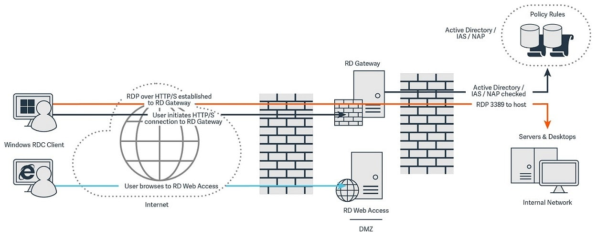

# Introduction to RDP (Remote Desktop Protocol)

**Definition:** RDP (Remote Desktop Protocol) is a communication protocol used to allow a user to remotely control a Windows computer or server over the network.

**Purpose:** RDP is used for remote administration, technical support, and accessing resources on Windows computers from remote locations.

## How RDP Works

**Client and Server:** RDP involves a client (remote user) connecting to a server (remote Windows computer or server).

**Graphics and Input:** RDP transmits graphical information and input, allowing the remote user to view the remote computer's screen and interact with it as if they were physically present.

**Default Port:** The default TCP port for RDP is 3389.

## Features and Capabilities of RDP

**Remote Desktop:** RDP allows remote users to access and control the remote computer's desktop.

**File Transfer:** It is possible to copy and transfer files between the local and remote computers during an RDP session.

**Peripheral Redirection:** RDP supports redirection of devices such as printers and storage drives to the remote computer.

## Security Protocol

**Authentication:** RDP requires authentication before granting access. This may include passwords and two-factor authentication.

**Encryption:** RDP sessions can be encrypted to protect the confidentiality of transmitted data.

**Security Levels:** RDP offers security configuration options, such as choosing encryption and authentication levels.

## Common Uses of RDP

**Remote Technical Support:** Technical support professionals use RDP to troubleshoot issues on remote computers or servers.

**Server Administration:** System administrators use RDP to manage Windows servers in data centers or remote locations.

**Access to Corporate Resources:** RDP allows employees to securely access corporate applications and data from remote devices.

## Alternatives to RDP

**VNC (Virtual Network Computing):** VNC is an open-source alternative to RDP that offers similar remote control functionality and is compatible with various platforms.

**TeamViewer:** A popular commercial solution for remote access and support that works on multiple platforms.

## Risks and Security Considerations

**Brute Force Attacks:** Weak passwords can be exploited by brute force attacks against RDP. Using strong passwords and limiting access is crucial.

**Internet Exposure:** Directly opening RDP port 3389 to the internet can increase the risk of hacker attacks. Using VPNs or additional security measures is recommended.

## Security Recommendations

**Use of VPN:** Using a VPN (Virtual Private Network) can provide an additional layer of security when establishing RDP connections over the internet.

**Updates and Patches:** Keeping the operating system and RDP software up to date with the latest security patches is crucial.

## Conclusion

RDP is a powerful tool for remote access to Windows systems, allowing users to control computers and servers from a distance. However, security should be a priority when configuring and using RDP, as improper exposure to the internet can pose significant security risks. Understanding how RDP works and following security best practices is essential to safely enjoy its benefits.
