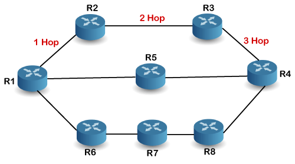

# Introduction to RIP (Routing Information Protocol):

## Definition:
RIP (Routing Information Protocol) is an internal routing protocol used in IP networks to determine routes and exchange routing information between routers.

## Purpose:
RIP is designed for small to medium-sized networks and offers a simple way of vector distance-based routing.

## How RIP Works:
Routing Algorithm: RIP uses the Bellman-Ford algorithm to calculate the shortest routes based on hop count between routers.

Routing Metric: RIP's metric is counted in hops, where each hop represents passing through a router.

## Versions of RIP:
RIP v1: The original version of RIP, widely used but limited in features such as support for Variable Length Subnet Masking (VLSM) and authentication.

RIP v2: A later version that provides support for VLSM, authentication, and other advanced features.

## How RIP Operates:
Exchange of Updates: RIP routers exchange routing updates at regular intervals or when changes occur in the network's topology.

Hop Count: RIP routers maintain routing information based on the number of hops to a destination network.

## RIP Convergence Time:
Convergence Time: RIP has a relatively slow convergence time as it relies on periodic exchange of routing information.

Loop Control: RIP uses split horizon and infinite count mechanisms to prevent routing loops.

## RIP Authentication:
Authentication: RIP v2 supports authentication to ensure that routing updates originate from trusted sources.

## Drawbacks of RIP:
Scaling Limitations: RIP is not suitable for large networks due to its scalability limitations.

Slow Convergence: RIP may take time to recover after changes in the network topology.

## Examples of Use Cases:
Small Local Networks: RIP is suitable for small local networks, such as home networks or small offices.

Training Labs: It is often used in training labs and educational environments to teach routing principles.

## Alternatives to RIP:
OSPF: For larger and more complex networks, OSPF (Open Shortest Path First) is a more scalable and advanced alternative.

BGP: For service provider networks and large corporate networks, BGP (Border Gateway Protocol) is the common choice.

Conclusion:
RIP is a simple routing protocol suitable for small to medium-sized networks. However, due to its limitations in terms of scalability and convergence time, many networks opt for more advanced routing protocols like OSPF or BGP to meet their routing needs. Understanding the advantages and disadvantages of RIP when designing and managing networks is essential.
