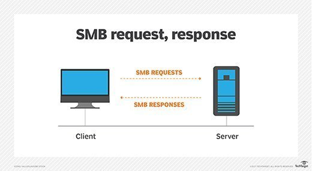

# Introduction to SMB (Server Message Block)

## Definition

SMB (Server Message Block) is a communication protocol used for sharing resources such as files, printers, and network devices among computers in a local network.

## Origin

Developed by Microsoft in the 1980s, SMB is widely utilized in Windows operating systems.

## How SMB Works

SMB operates at the data link layer of the OSI model and involves client-server communications. The client requests access to shared resources on the server through SMB requests, which include operations like file opening, reading, writing, and directory listing.

## Authentication in SMB

To access password-protected resources, SMB requires authentication. Users provide credentials, such as a username and password, to gain access, and it is possible to configure access levels, such as read-only, write, or full control, for individual shares and resources.

## Versions of SMB

- **SMB1:** The first version, discouraged due to security vulnerabilities.
- **SMB2:** Introduced performance and security improvements.
- **SMB3:** Offers data encryption, failover support, and advanced features.

## Common Uses of SMB

- **File Sharing:** Widely used for sharing files and folders in local networks and collaborative work environments.
- **Network Printing:** Used to share printers, allowing multiple devices to print to a single shared printer.
- **Access to Network Resources:** In addition to files and printers, SMB can be used to share other resources such as scanners and network-attached storage (NAS) devices.
