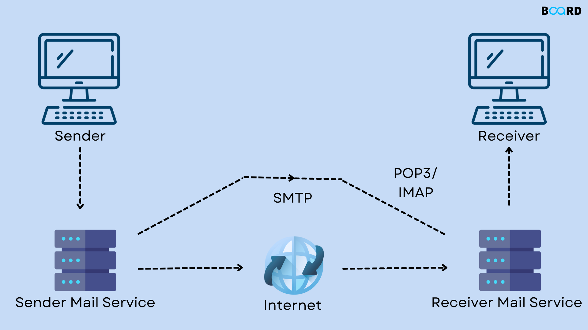

# Introduction to SMTP (Simple Mail Transfer Protocol)

**Definition:** SMTP (Simple Mail Transfer Protocol) is a communication protocol used to send emails over computer networks.

**Purpose:** SMTP is crucial for email delivery on the Internet, allowing messages to be sent from a sender's email server to a recipient's email server.

## How SMTP Works

**Client and Server:** SMTP involves a client (sender's email software) connecting to an SMTP server (sender's email server) to send a message.

**Reliable Delivery:** SMTP is designed to ensure the reliable delivery of emails. It makes multiple delivery attempts and returns error messages in case of failure.

## Composition of an SMTP Message

**Sender and Recipient:** An SMTP message contains information about the sender and recipient, including email addresses.

**Message Body:** The message body contains the text or attachments of the email.

**Headers:** Message headers include additional information such as the subject, date, and other control fields.

## SMTP Delivery Process

**Server Connection:** The SMTP client connects to the sender's SMTP server.

**Authentication:** The client may need to authenticate with the server using a username and password.

**Message Sending:** The client sends the SMTP message to the server, which temporarily stores it.

**Routing:** The SMTP server checks the recipient's domain and forwards the message to the recipient's SMTP server.

**Final Delivery:** The recipient's SMTP server delivers the message to the recipient's mailbox.

## Ports and Protocols

**Default Port:** The default TCP port for SMTP is 25. However, ports 587 (SMTPS) and 465 (SMTP with SSL) are used for secure communications.

**TLS/SSL:** TLS (Transport Layer Security) and SSL (Secure Sockets Layer) are protocols used to encrypt SMTP communication, ensuring message privacy and security.

## Common Uses of SMTP

**Email Sending:** SMTP is used in email clients to send messages to email servers.

**Email Servers:** Email servers use SMTP to forward, deliver, and store email messages.

**Authentication:** Many SMTP servers require authentication to prevent misuse.

## SMTP Authentication

**SMTP Authentication:** Authentication is essential to prevent unauthorized use of SMTP servers.

**Authentication Methods:** Common authentication methods include LOGIN, PLAIN, CRAM-MD5, and AUTH.

## Risks and Security

**Spam and Abuse:** SMTP is vulnerable to abuse by spammers. Filtering mechanisms and authentication are used to mitigate this issue.

**Phishing:** Malicious phishing emails can be sent through SMTP. User education is crucial to avoid falling victim to scams.

## Alternatives to SMTP

**IMAP and POP3:** These protocols are used by email clients to receive messages from email servers. They are not involved in sending emails.

**MIME:** The MIME (Multipurpose Internet Mail Extensions) protocol is used for attaching files and formatting email messages.

## Conclusion

SMTP is an essential protocol for sending emails on the Internet. It plays a fundamental role in digital communication, allowing people to send messages to recipients worldwide. Understanding how SMTP works is important for email users and IT professionals who want to maintain the integrity and security of email communications.
