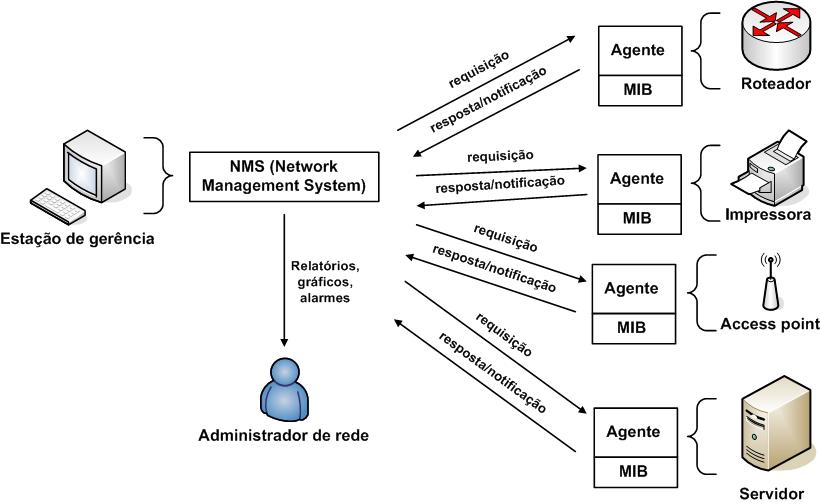

# Introduction to SNMP

**Definition:** SNMP, which stands for Simple Network Management Protocol, is a standard protocol used to manage and monitor network devices and computer systems.

**Purpose:** The primary purpose of SNMP is to enable administrators to collect information about the state and performance of network devices and, if necessary, configure these devices remotely.

## Components of SNMP
**SNMP Manager:** The SNMP manager is a network management system that collects information from managed devices and sends configuration commands if needed.

**SNMP Agent:** The SNMP agent is software residing on network devices that collects and stores local information and responds to requests from the SNMP manager.

**MIB (Management Information Base):** The MIB is a hierarchical data structure that defines the information that can be managed by SNMP devices. It organizes data in a tree-like structure, with each branch representing a type of information.

## SNMP Versions
**SNMPv1:** The first version of SNMP introduced the basic concepts of network management but had limitations in terms of security and functionality.

**SNMPv2:** The second version included improvements in the MIB structure and event management but still had security limitations.

**SNMPv3:** The third version of SNMP significantly improved security by adding authentication and encryption. It is the most secure and widely used version today.

## SNMP Operations
- **GET:** The manager requests a specific variable from the MIB on an agent.
- **GETNEXT:** The manager requests the next variable in the MIB.
- **GETBULK:** The manager requests a large set of variables at once.
- **SET:** The manager can configure variables on the agent using this operation.
- **Trap/Inform:** The agent sends a notification to the manager when a specific event occurs.

## SNMP Security
**Authentication:** SNMPv3 includes authentication and encryption to protect communications between the manager and agent.

**SNMP Communities:** In older versions, SNMP communities were used for authentication, but they were insecure as they used plain text passwords.

## Common Uses of SNMP
- **Network Monitoring:** SNMP is used to monitor network traffic, CPU load, memory usage, and other parameters on network devices.
- **Device Management:** Administrators use SNMP to remotely configure network devices such as routers and switches.
- **Troubleshooting:** SNMP helps identify network issues such as hardware failures or excessive traffic.

## SNMP Tools
- **SNMP Walk:** A tool that allows you to explore the MIB of a device to see what information is available.
- **SNMP MIB Browser:** A tool that makes it easier to query and navigate the MIB of a device.

## Alternatives to SNMP
- **NetFlow:** A protocol that collects and analyzes network traffic information for monitoring and security purposes.
- **RESTful APIs:** A more modern approach to managing network devices through HTTP-based APIs.

## Conclusion
SNMP plays a crucial role in managing network devices, enabling administrators to monitor, configure, and troubleshoot a wide range of equipment. SNMP has evolved over time to be more secure and functional, making it an essential tool for network administrators in IT environments.
