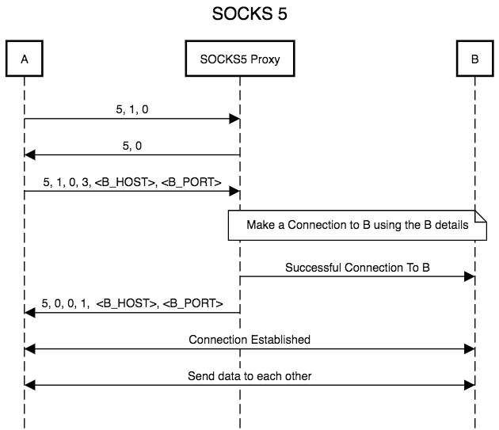

# Introduction to SOCKS (SOCKS Protocol)

**Definition:** SOCKS (SOCKS Protocol) is a network protocol that acts as an intermediary between a client and a server. Its primary function is to allow a client to access resources on the Internet anonymously and securely.

**Purpose:** SOCKS is used to bypass firewall restrictions, maintain user privacy, and ensure secure connections.

## How SOCKS Works

**Intermediary:** SOCKS acts as an intermediary (proxy) between the client and the server. When the client makes a request, it is first sent to the SOCKS server, which forwards it to the destination server.

**Anonymity:** SOCKS hides the client's real IP address from the destination server, providing a layer of anonymity.

**Protocol Support:** SOCKS supports various application protocols, making it versatile for different types of traffic.

## Versions of SOCKS

**SOCKS4:** An older version that provides basic proxy functionality but does not support authentication.

**SOCKS4a:** An extension of SOCKS4 that allows the client to specify a domain name instead of an IP address.

**SOCKS5:** The latest and most versatile version that supports authentication, domain name resolution at the SOCKS server, and multiple authentication methods.

## Authentication in SOCKS5

**Username/Password:** SOCKS5 allows user-based authentication with a username and password, protecting against unauthorized access to the proxy.

## Common Uses of SOCKS

**Internet Access in Restricted Networks:** SOCKS is used to access the Internet in networks where direct access is restricted by firewalls or network policies.

**Online Privacy:** SOCKS is used to hide the client's real IP address when accessing websites and online services.

**Access to Region-Restricted Content:** Some people use SOCKS to bypass geographical restrictions and access content blocked in their country.

## Configuration of SOCKS Client and Server

**Client:** The client needs to be configured to connect to the SOCKS server. This is usually done in the settings of the software or application being used.

**Server:** A SOCKS server must be set up to accept client connections and forward requests to the Internet.

## Security in SOCKS

**Authentication:** Authentication is important to prevent unauthorized use of the SOCKS proxy.

**Encryption:** Using an additional layer of encryption, such as VPNs, alongside SOCKS, can enhance security and privacy.

## Alternatives to SOCKS

**Virtual Private Network (VPN):** VPNs are another way to ensure secure and anonymous Internet connections, but they operate differently from SOCKS.

**HTTP Proxy:** HTTP proxies are common, especially in web browsers, and can be used for similar purposes, but they are generally not as versatile as SOCKS.

## Conclusion

SOCKS is a powerful technology that enables secure and anonymous communication on the Internet, bypassing network restrictions and protecting user privacy. However, it's essential to configure and use it correctly and with caution, as it can be abused for malicious purposes. Understanding how SOCKS works is valuable for network administrators and users who want to maintain online privacy and security.
