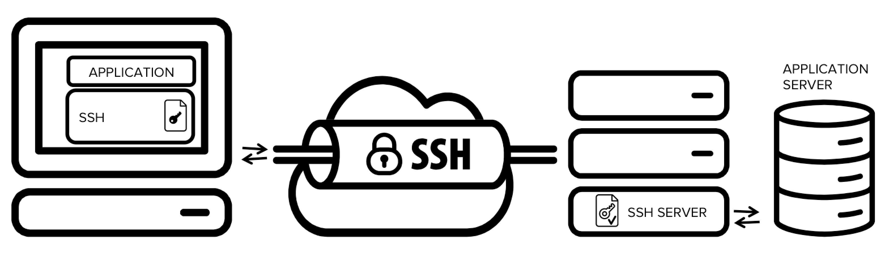

# Introduction to SSH:

## Definition:
SSH, or Secure Shell, is a network protocol that provides a secure way to access remote systems and devices through a command-line interface.

## Purpose:
SSH is used for authenticating, encrypting, and securing communications between a client and a server, making it essential for remote administration and secure data transfer.

## How SSH Works
Encryption: SSH uses asymmetric (public/private key) cryptography for authentication and symmetric encryption to protect transmitted data.

Default Port: The default port for SSH is port 22, although it can be configured to use other ports.

## Public and Private Key
Public Key: It is the key used to authenticate the user on the server. It is stored on the server and shared with the client.

Private Key: It is the key that the client keeps secret. It is used to prove the client's identity to the server.

## Commands and Basic Usage
SSH Connection: Use the `ssh` command followed by the username and IP address or hostname of the server to initiate an SSH session.

Key Authentication: It's possible to authenticate using a public-private key pair. Use `ssh-keygen` to generate and set up your keys.

File Transfer: SSH supports secure file transfer using SCP (Secure Copy) or SFTP (Secure File Transfer Protocol).

## Types of Authentication
Password: Password-based authentication, where the user enters a password to access the server.

Public/Private Key: Authentication using a cryptographic key pair, where the private key is protected by the client.

## SSH Server Configuration
Configuration File: The SSH server can be configured through the `/etc/ssh/sshd_config` file on Linux/Unix systems.

Access Restrictions: It's possible to define which users are allowed to access the SSH server and which IP addresses can connect.

## SSH Security
Common Attacks: SSH can be targeted by brute-force attacks and social engineering attacks. Security measures like disabling root login and using key authentication are essential.

## Examples of Use Cases
Server Administration: System administrators use SSH to securely manage remote servers.

Secure File Transfer: SSH is used to transfer files between systems securely, replacing insecure protocols like FTP.

## Conclusion
SSH is a critical tool for ensuring the security of communications and remote system administration. With strong authentication and encryption capabilities, it is widely adopted in network environments to protect data and ensure the integrity of remote operations. Knowing and understanding SSH is essential for anyone working with system and network administration.
