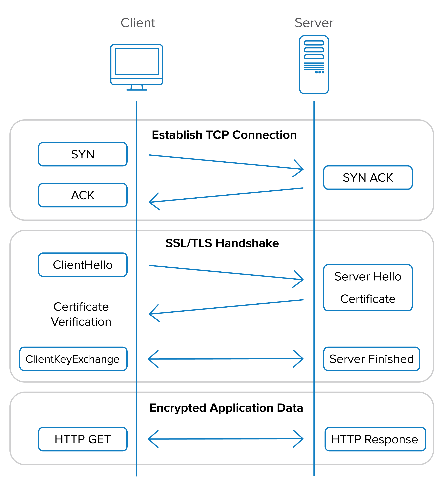

# Introduction to SSL/TLS:

## Definition:
SSL/TLS (Secure Sockets Layer/Transport Layer Security) is a security protocol that provides encryption, authentication, and data integrity for network communications.

## Purpose:
SSL/TLS is used to protect sensitive information such as passwords, credit card data, and confidential communications, making them unreadable to third parties.

## History and Evolution
SSL vs. TLS: SSL was developed by Netscape in the 1990s and later evolved into TLS. TLS 1.0 is often referred to as SSL 3.1.

Security Enhancements: Later versions of TLS introduced improvements in encryption and security, addressing known vulnerabilities.

## How SSL/TLS Works
Handshake: SSL/TLS begins with a handshake between the client and server, where they agree on a set of cryptographic algorithms and exchange session keys.

Encryption: Subsequent communication is encrypted using symmetric algorithms like AES and the session keys agreed upon during the handshake.

Authentication: SSL/TLS can authenticate both the server and the client, ensuring that the involved parties are who they claim to be.

## SSL/TLS Certificates
Certificate Authorities (CAs): CAs issue digital certificates that attest to the authenticity of entities, such as websites. Examples of CAs include Let's Encrypt and DigiCert.

Components of a Certificate: A certificate contains information like the server's public key, domain name, expiration date, and the CA's signature.

## Common SSL/TLS Protocols
HTTPS: HTTPS is the protocol that uses SSL/TLS to provide security in web communications, ensuring that websites are secure.

SMTPS, FTPS, IMAPS: These protocols use SSL/TLS to protect email communications, file transfers, and email access.

## Security and Challenges
Poodle, Heartbleed, BEAST: SSL/TLS vulnerabilities that required security updates and fixes.

Brute Force Attacks: Strong encryption is essential to resist brute force attacks on cryptographic keys.

## Implementations and Configurations
Server Configuration: Web server administrators must configure their servers to support SSL/TLS and keep certificates up to date.

Software Updates: Keeping SSL/TLS software up to date is crucial to avoid known vulnerabilities.

## Examples of Use Cases
Secure Website Access: Browsers use SSL/TLS to protect personal and payment information on online shopping sites, banks, and email services.

Secure Communications: Businesses use SSL/TLS to protect internal and external communications, ensuring the confidentiality of business information.

## Conclusion
SSL/TLS is a critical technology for safeguarding the confidentiality and integrity of communications on the Internet. Understanding how SSL/TLS works, its evolution, configuration, and security challenges is essential to ensure the protection of personal and business information in online environments.
