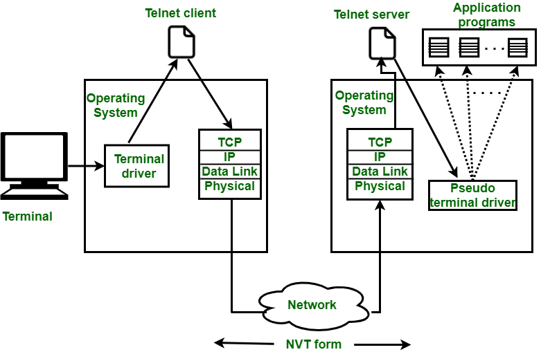

# Introduction to Telnet:

## Definition:
Telnet is an application protocol that allows remote connection to a system or device over a network, typically the Internet.

## Purpose:
Telnet is used for remote administration and management of systems, such as servers, routers, and switches, as well as for accessing network resources and services.

## How Telnet Works
Virtual Terminal: Telnet establishes a virtual terminal session on a remote device, allowing the user to interact with it as if they were physically present.

Client-Server Protocol: Telnet communication is based on a client-server model, where a Telnet client connects to a Telnet server.

Default Port: The default port for Telnet is port 23.

## Security and Limitations of Telnet
Insecure Authentication: Telnet transmits data, including passwords, in plain text, making it vulnerable to interception attacks.

Secure Alternatives: Due to security concerns, SSH (Secure Shell) is widely preferred over Telnet for remote connections as it provides secure encryption and authentication.

## Commands and Basic Usage
Connecting to a Telnet Server: Use a Telnet client (such as PuTTY or the system's built-in Telnet client) to connect to a Telnet server by specifying the hostname or IP address and the port.

Commands in the Remote Terminal: After a successful connection, you can enter commands directly into the remote terminal.

Session Termination: To end a Telnet session, you can use the "exit" or "logout" command, depending on the remote system.

## Telnet on Different Systems
Telnet on Windows: Windows includes a Telnet client that can be enabled in system settings.

Telnet on Linux/Unix: Many Linux distributions and Unix systems have built-in support for Telnet servers.

## Telnet in Networking
Common Uses: Telnet is used for server administration, router and switch configuration, network troubleshooting, and even accessing legacy chat services.

## Examples of Use Cases
Server Administration: System administrators use Telnet to manage servers remotely, especially in environments where security is not a major concern.

Configuring Network Devices: Routers and switches often provide Telnet interfaces for configuration and monitoring.

## Conclusion
Telnet is a useful tool for accessing and managing remote devices and systems, but its lack of security makes it unsuitable for many scenarios. It's important to be aware of the limitations of Telnet and consider more secure alternatives like SSH when making remote connections in security-focused environments.
