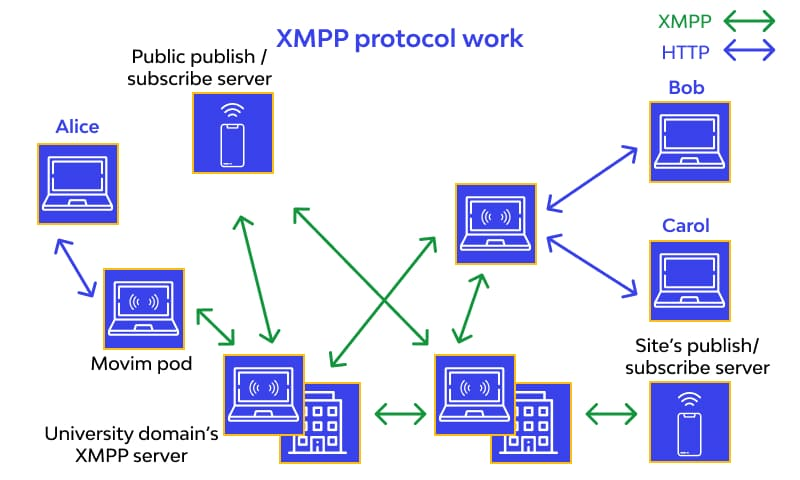

# Introduction to XMPP (Extensible Messaging and Presence Protocol)

## Definition

XMPP (Extensible Messaging and Presence Protocol) is a real-time communication protocol based on XML used for exchanging messages and presence information between devices on the Internet.

## History

XMPP evolved from the Jabber protocol, which was developed in the 1990s as an open-source, interoperable instant messaging protocol.

## How XMPP Works

### Peer-to-Peer Communication

XMPP enables point-to-point communication between two or more devices. XMPP clients connect to XMPP servers, which route messages to the appropriate recipients.

### Open Protocol

XMPP is an open and extensible protocol, meaning it can be customized and extended to meet various needs.

## Jabber ID (JID)

### User Identification

Each XMPP user is identified by a JID, similar to an email address. The JID consists of a username and a domain.

Example JID: "user@example.com/resource."

## XMPP Features

### Instant Messaging

XMPP is widely used for real-time instant messaging.

### Presence

The protocol allows users to inform others of their availability status, such as "online," "busy," or "offline."

### File Sharing

Many XMPP clients support file sharing between users.

## Extensibility of XMPP

### XMPP Extension Protocols (XEPs)

XMPP is highly extensible through the use of XEPs, which are extension protocols that add additional functionality, such as encryption, video conferencing, and location sharing.

Example Extension: XEP-0066 defines the file sharing protocol via XMPP.

## Security in XMPP

### TLS/SSL

Most XMPP implementations support TLS/SSL encryption to protect communications.

### Authentication

XMPP supports various authentication methods, including passwords and certificates.

## Common Uses of XMPP

### Instant Messaging

XMPP is widely used in instant messaging clients like Pidgin, Adium, and Spark.

### Real-Time Messaging Services

Companies and real-time messaging applications use XMPP to create communication platforms.

### Internet of Things (IoT)

XMPP is used in IoT solutions for communication between devices.

## Alternatives to XMPP

### WhatsApp

While initially based on XMPP, WhatsApp transitioned to its proprietary model.

### Signal

An end-to-end encrypted messaging app that uses its own protocol.

## Conclusion

XMPP is a flexible and extensible real-time communication protocol that plays a fundamental role in instant messaging, online presence, and many other communication applications. Its extensible and open nature makes it a popular choice for businesses looking to create custom communication solutions.
